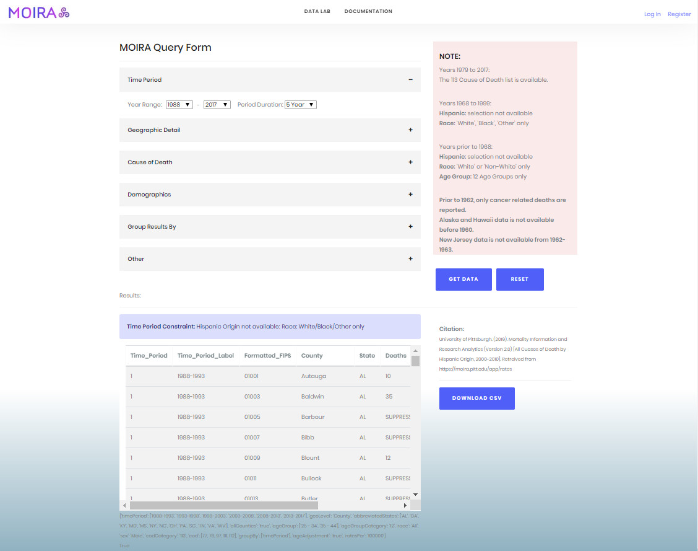
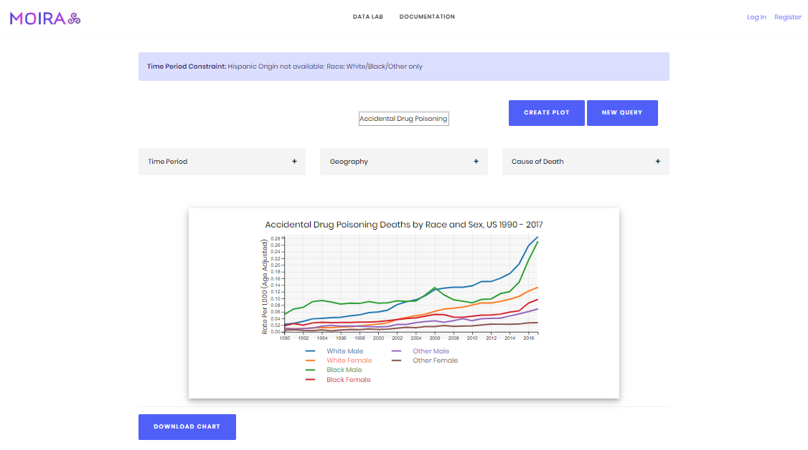
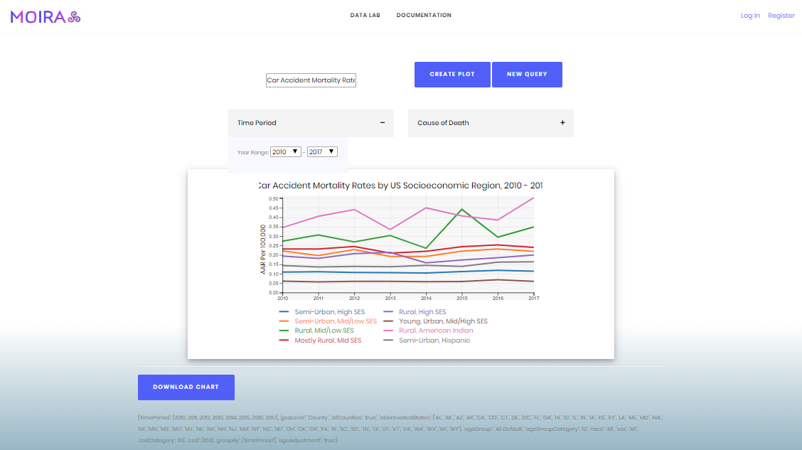
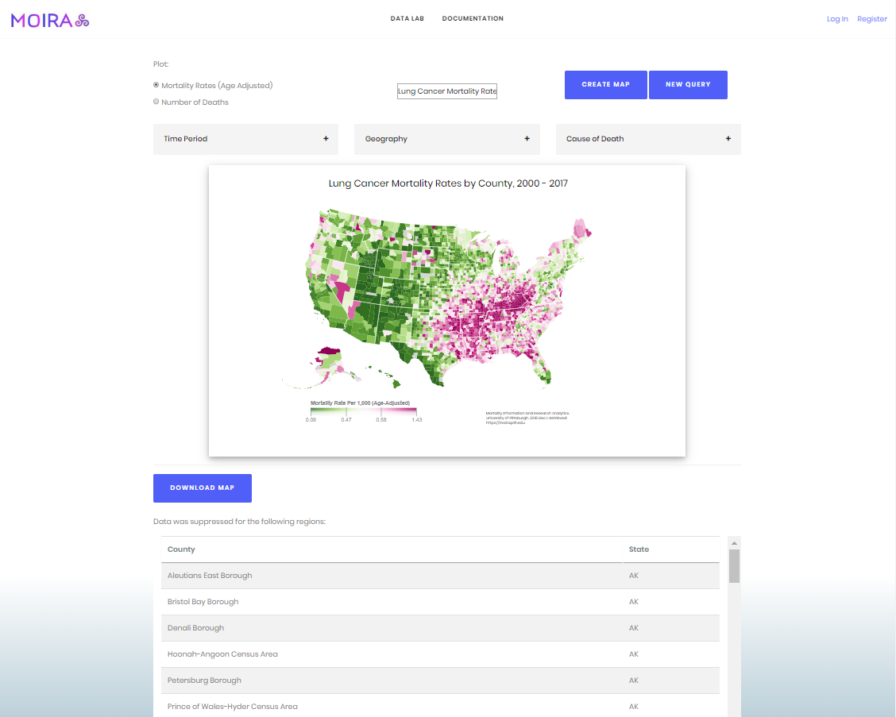
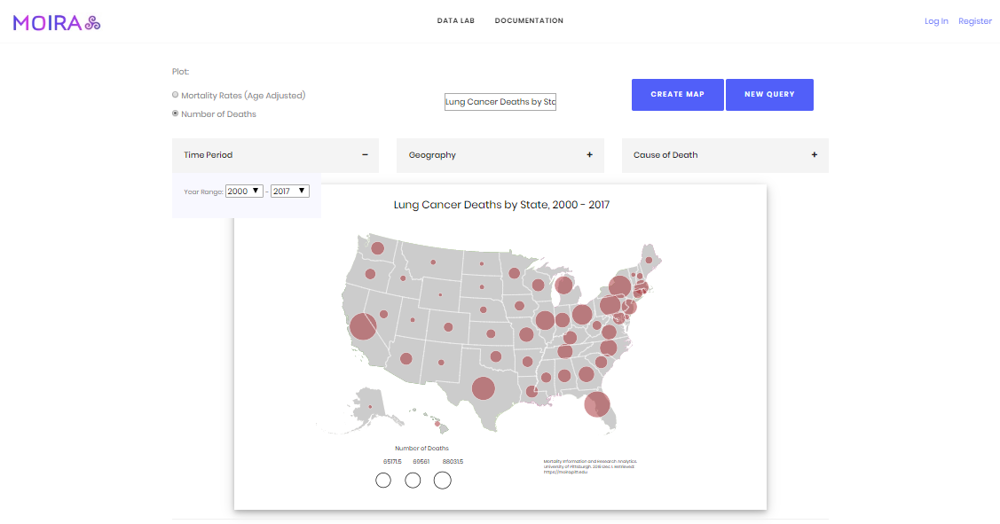
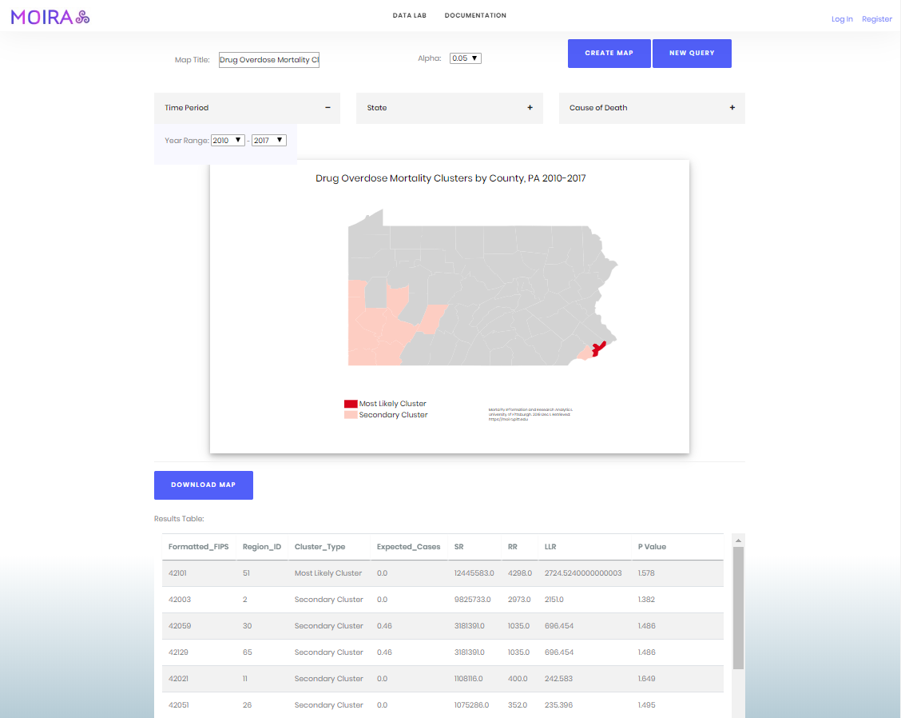
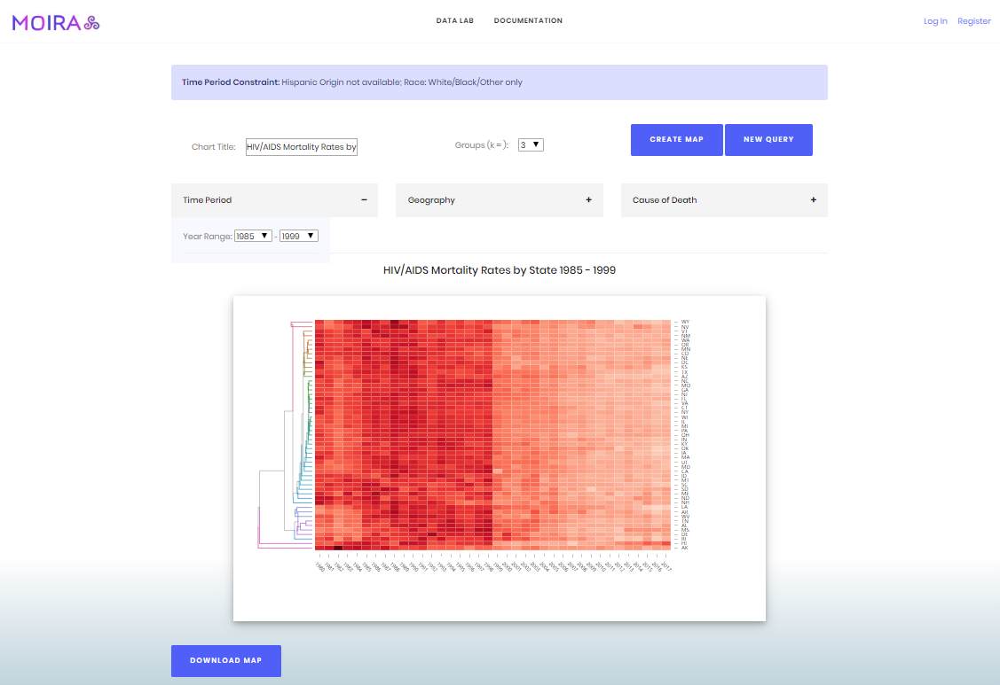
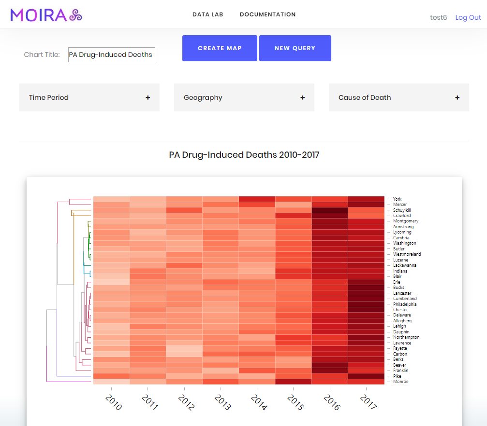

# MOIRA: Mortality Information Research Analytics
The University of Pittsburgh developed and has, since 1980, maintained the Mortality Information and Research Analytics system. MOIRA was built to facilitate the extraction and visualization of US mortality and population data in a standardized format. The source data are provided by the National Center for Health Statistics and the US Census Bureau.

This repository contains the underlying codebase for the MOIRA web prototype, which was built using the Django web framework in Python. For an introduction to development in Django, please reference the [Django documentation](https://docs.djangoproject.com/en/3.0/) and this helpful [YouTube tutorial](https://www.youtube.com/playlist?list=PLw02n0FEB3E3VSHjyYMcFadtQORvl1Ssj).

## Getting started
The following instructions detail how to install, run and make changes to the MOIRA web

### Navigate to:
* [Modules](https://github.com/geominr/moira-public#components)
    * [Data Query](https://github.com/geominr/moira-public#data-query)
    * [Time Series Chart](https://github.com/geominr/moira-public#time-series-charts)
    * [Geography](https://github.com/geominr/moira-public#geography)
    * [Flexible (Spatial) Clustering](https://github.com/geominr/moira-public#flexible-clustering)
    * [Temporal Clustering](https://github.com/geominr/moira-public#temporal-clustering)
    * [Secondary Data](https://github.com/geominr/moira-public#secondary-data)
* [Components](https://github.com/geominr/moira-public#components)
* [Adding an Analytical Module](https://github.com/geominr/moira-public#adding-an-analytical-module)
* [Incorporating Secondary Data with MOIRA](https://github.com/geominr/moira-public#adding-secondary-data-to-moira)

## Modules
#### Data Query
Users who wish to extract raw data from MOIRA can use the Data Query module. This module includes all available selection criteria, allowing users to filter results by time period, geography, demographics and cause of death. After completing the query form, MOIRA displays the results to the user as a table. In the event that the user makes a mistake in the selection criteria, they can inspect the result of the query in the browser prior to downloading the file in CSV format.

#### Time Series Charts
A key component of the new MOIRA system is time series analysis. Because MOIRA queries can be grouped by time period as well as other demographic or geographic variables, the results can be charted over time to compare mortality rates among different regions, socioeconomic clusters and demographics.
##### Race and Sex

##### Socioeconomic Regions

#### Geography
Another key component of MOIRA is geography. Data is queried from MOIRA by geographic region at the national, state or county level. In this module, the results are simply mapped to their corresponding geography within a JSON file of the United States to render a choropleth or bubble map of mortality rates (or deaths) for a selected time period, region(s), and cause(s) of death.
##### Choropleth Map
The map below shows a map of the lung cancer mortality rates across the US for the time period 2000-2017. The geography module generates a MOIRA query which aggregates the mortality rates over the entire selected time period.

##### Bubble Map
The map below shows a US state map with a bubble at each centroid with a radius corresponding to the number of deaths over the selected time period. The legend plots the 25th, 50th and 75th percentile values.

#### Flexible Clustering

#### Temporal Clustering

#### Secondary Data


[Back to top](https://github.com/geominr/moira-public#moira-mortality-information-research-analytics)
## Components
The backend system is made up of the following components:
### Component 1: [/accounts](https://github.com/geominr/MOIRA/tree/master/accounts)
This folder contains the python files which interact with the MOIRA API and render the user interface (Model and View). 
#### Model:
* [rates.py](https://github.com/geominr/MOIRA/blob/master/accounts/rates.py) interacts with MOIRA API. The following code is a high-level view of how the system extracts data from the API and returns it to the View
```python
# the get_rates function hits the MOIRA API with the user's selection criteria
def get_rates(form_data, query):
    # log_in authenticates the user and returns the API key
    headers = {'Authorization': log_in(USERNAME, PASSWORD), 
               'Content-Type': "application/json",
               'Host': "moira.pitt.edu"}

    # the form validation function, which is varies by query type, 
    # returns the API payload, valid/invalid and messages about 
    # time constraints or invalid selection criteria
    valid, payload, messages = validate_form(form_data)
    response = requests.request("POST", 
                                "https://moira.pitt.edu/api/get_rate", 
                                data=payload.replace("'","\""), 
                                headers=headers)
    return payload, response.text, messages
    
# the get_csv function converts the API response to a Pandas DataFrame 
# and saves the results as a static file which is loaded by the view to 
# generate tables and visualizations
def get_csv(data, analytics = False):
    
    contents = pd.read_csv(StringIO(data), sep=",")
    
    # Here is where you would execute functions that manipulate or analyze the data
    # Let R_analytics() represent a command which executes as an R script that takes 
    # in a dataset and returns a new dataset of statistics to create a map or chart...
    if analytics == True:
        contents = R_analytics(contents)
    
    contents.to_csv('accounts/static/temp_result.csv', index=False)
    
    return contents

```
* [models.py](https://github.com/geominr/MOIRA/blob/master/accounts/models.py) - interacts with backend database
#### View:
* [views.py](https://github.com/geominr/MOIRA/blob/master/accounts/views.py) renders each view (webpage), handles form submission to generate MOIRA queries and return data to the user with functions from [rates.py](https://github.com/geominr/MOIRA/blob/master/accounts/rates.py)
```python
# Each view is a class with a get and a post function
# Here we use the Race and Sex time chart module as an example
class RaceSexView(TemplateView):
    # This lets the system to know which HTML document to use as the template
    template_name = 'accounts/plotRS.html'
    
    # The get function renders the template when there is an HTTP GET request made
    def get(self, request):
        # APIform2() is a class within forms.py which contains each module's the form widgets
        race_sex_form = APIform2() 
        
        text = 'Plot mortality rates by race and sex over time'
        MOIRA.get_csv('{"temp":"temp"}', get=True) # this overwrites the previous temporary file
        
        # The dictionary agrs tells the system which components to render with the rest of the template.
        # In each template, these objects are referenced in double curly brackets as e.g., {{ text }}
        args = {'race_sex_form':race_sex_form, 'text':text}
        return render(request, self.template_name, args)

    # The post function executes when there is an HTTP POST request, i.e., when the user submits the form
    def post(self, request):
        # we pass request.POST to APIform2 in order to return the user's selection criteria
        race_sex_form = APIform2(request.POST) 
        if race_sex_form.is_valid():
            # returns a dictionary of values
            form_data = race_sex_form.cleaned_data 
            
            # with the cleaned selection criteria, we hit the API using rates.py#get_rates
            query, text, messages = MOIRA.get_rates(form_data, 'rs')
            
            # if there is an issue with the data, we create HTML alerts to communicate to the user
            if 'error' in text:
                alerts = "<div class=\"alert alert-brand\"><strong>Invalid Cause of Death Category</strong></div>"
            elif '<!DOCTYPE html>' in text: # or '<!DOCTYPE html>' in rs_text:
                text = 'Please try another time period in your selection.'
                alerts = "<div class=\"alert alert-brand\"><strong>Please Try Another Time Period</strong> - Thank you!</div>"
            else:
                # if there is no problem with the data, then we run the rates_RStime method 
                # to manipulate the dataset into the right format to create our time chart
                text = MOIRA.rates_RStime(text)
                df, suptable = MOIRA.get_csv(text, RS = True)
                text = ""
                alerts = ""
            
            title = form_data['title_2']
            
            # This function creates an HTML alert for each message returned by the form validation function
            if len(messages) > 0:
                for message in messages:
                    alert = "<div class=\"alert alert-brand\">"+message+"</div>" 
                    alerts = alerts + alert
            

        else:
            text = "Invalid Submission"
    
        # The dictionary args tells the system which components to render with the rest of the HTML template
        # the mark_safe() function allows the system to add code directly into the HTML/JavaScript template 
        args = {'race_sex_form':race_sex_form, 'alerts':mark_safe(alerts), 'title':mark_safe(title), 'text':text, 'query':mark_safe(query), 'suptable':mark_safe(suptable)}
        return render(request, self.template_name, args)
    
    
```
* [forms.py](https://github.com/geominr/MOIRA/blob/master/accounts/forms.py) renders HTML form widgets for MOIRA selection criteria. Each form is a [class](https://github.com/geominr/MOIRA/blob/d10abcb9f96765f1148fbc4e4f18bc08edb13b5e/accounts/forms.py#L353) consisting of [Django widgets](https://docs.djangoproject.com/en/2.2/ref/forms/widgets/) specific to each module.  

#### [accounts/templates](https://github.com/geominr/MOIRA/tree/master/accounts/templates)
#### [accounts/static](https://github.com/geominr/MOIRA/tree/master/accounts/static)
### Component 2: [/moira_2019](https://github.com/geominr/MOIRA/tree/master/moira_2019)
This folder contains python files which initialize system settings 
#### Controller:
* [settings.py](https://github.com/geominr/MOIRA/blob/master/moira_2019/settings.py)
* [urls.py](https://github.com/geominr/MOIRA/blob/master/moira_2019/urls.py)
* [wsgi.py](https://github.com/geominr/MOIRA/blob/master/moira_2019/wsgi.py) 


[Back to top](https://github.com/geominr/moira-public#moira-mortality-information-research-analytics)
## Adding an Analytical Module
In the following code snippets, we demonstrate how to add a new module to the MOIRA system. This example is for Temporal Clustering, which creates a [d3heatmap](https://www.rdocumentation.org/packages/d3heatmap/versions/0.6.1.2/topics/d3heatmap) using MOIRA data. This output allows users to analyze trends and relationships between different mortality groupings over time. This is what the output will look like. Drug-induced deaths by county in PA (2010-2017):


### Step 1: Add APIform7 class to forms.py

To create this module, we will replicate much of the code from other modules. Notice that the module has two components: the form and the output. In each module the user creates a query by selecting a year-range, a geography and a cause of death. To allow this, we need to create the form in the backend. 
First, we want to create a new form class so that the user can specify their selection criteria for their MOIRA query. To do this, we add a new class called APIform7 to the forms.py file, copying the same widgets from APIform6. 
```python
class APIform7(forms.Form):
    title_7 = forms.CharField(widget=forms.TextInput(attrs={'placeholder':'Enter Map Title Here'}))
    year1_7 = forms.ChoiceField(label="Range\n\n", 
                              widget=forms.Select, 
                              choices=YEARS)
    year2_7 = forms.ChoiceField(label="\n\nto\n\n", 
                              widget=forms.Select, 
                              choices=YEARS)
    geoLevel_7 = forms.ChoiceField(label="Geographic Detail", widget=forms.RadioSelect, choices=[("State","State"),("County","County")])
    ageAdjustment_7 = forms.ChoiceField(label="Age Adjusted", widget=forms.HiddenInput, choices=[(True,"adj")], required=False)
    abbreviatedStates_7 = forms.MultipleChoiceField(label="States", widget=forms.SelectMultiple(attrs={'class':'form-control'}), choices=STATES, required=False)
    allCounties_7 = forms.ChoiceField(label="", widget=forms.CheckboxInput, initial = "true", choices=[(True,"adj"),(False,"no-adj")], required=False)
    ALselect_7 = forms.MultipleChoiceField(label="", widget=forms.SelectMultiple(attrs={'class':'form-control'}), choices=AL, required=False)
    AKselect_7 = forms.MultipleChoiceField(label="", widget=forms.SelectMultiple(attrs={'class':'form-control'}), choices=AK, required=False)
    ...
    cod_7 = forms.MultipleChoiceField(label="Cause of Death", widget=forms.SelectMultiple(attrs={'class':'form-control'}), initial="None", required=False, choices=CODs)
    cod113_7 = forms.MultipleChoiceField(label="Cause of Death",  widget=forms.SelectMultiple(attrs={'class':'form-control'}), required=False, choices=COD113)
    
```
### Step 2: Add TempClusteringView class to views.py
Now that the form for our temporal clustering module exists, we must create a view. To do this, we import the form into views.py on line 3, like this:
```python
from django.views.generic import TemplateView
from django.shortcuts import render, redirect
from accounts.forms import APIform, APIform2, APIform3, APIform4, APIform5, APIform6, APIform7
```
Next, we add a class called TempClusteringView, which will render the form and the template to the user with the get and post functions. For this class, we mostly replicate the code from our other views. 
```python
class TempClusteringView(TemplateView): 
    # first we set the template name to reference the module's html file
    template_name = 'accounts/temporal_clustering.html'
    
    def get(self, request):
        tc_form = APIform7()
        text = 'Create a time-series clustering heatmap. Please limit queries to a small number of counties.'
        MOIRA.get_csv('{"temp":"temp"}', get=True)
        args = {'tc_form':tc_form, 'text':text}
        return render(request, self.template_name, args)

    def post(self, request):
        tc_form = APIform7(request.POST)
        if tc_form.is_valid():
            form_data = tc_form.cleaned_data
            # here we generate our query by specifying which module we are using in get_rates
            query, text, messages = MOIRA.get_rates(form_data, 'timecluster')
            if 'error' in text:
                alerts = "<div class=\"alert alert-brand\"><strong>Invalid Cause of Death Category</strong></div>"
            elif '<!DOCTYPE html>' in text: # or '<!DOCTYPE html>' in rs_text:
                text = 'Please try another time period in your selection.'
                alerts = "<div class=\"alert alert-brand\"><strong>Please Try Another Time Period</strong> - Thank you!</div>"
            else:
                # here we do our data manipulation and analytics
                text = MOIRA.rates_TempClust(text, form_data['geoLevel_7'])
                df, suptable = MOIRA.get_csv(text, tempcluster=True)
                text = ""
                alerts = ""

            title = form_data['title_7']

            if len(messages) > 0:
                for message in messages:
                    alert = "<div class=\"alert alert-brand\">"+message+"</div>" 
                    alerts = alerts + alert

        else:
            text = "Invalid Submission"
            alerts = "<div class=\"alert alert-brand\"><strong>Please Try Again</strong> - Thank you!</div>"
            
        
        args = {'tc_form':tc_form, 'alerts':mark_safe(alerts), 'title':mark_safe(title), 'text':text, 'query':mark_safe(query), 'suptable':mark_safe(suptable)}
    
        return render(request, self.template_name, args)
```
### Step 4: Extend functionality of key methods in rates.py
#### In get_rates we add the following code:
```python
    elif query == 'timecluster':
        
        valid, payload, counties, messages = get_geo_payload(form_data, clustering=True)
        response = requests.request("POST", 
                                    "https://moira.pitt.edu/api/get_rate", 
                                    data=payload.replace("'","\""), 
                                    headers=headers)

        return payload, response.text, messages
```
#### In get_geo_payload we add the following code:
Note: we use get_geo_payload for this module to group the selection by time period and geography. This can be changed to group by demographics or cause of death.
```python
def get_geo_payload(form_data, time=False, clustering=False):
    """    
    -----------------------------------------------------------------------------------------------------
    1. Validate time period selection
    """
    # we set o to the corresponding number at the end of each form component e.g., year1_7 in APIform7
    if time:
        o = '6' # FOR TIME SERIES PLOT
    elif clustering:
        o = '7' # FOR TIME SERIES CLUSTERING
    else:
        o = '3' # FOR MAP
        
    timePeriod, form_valid, messages, c68_99, pre79, pre68, c62_63, pre62, pre60 = validate_time(form_data['year1_'+o], form_data['year2_'+o], form_data['abbreviatedStates_'+o])
    
    if form_valid:
        if time == False and clustering == False:
            timePeriod = [str(timePeriod[0])+" - "+str(timePeriod[len(timePeriod)-1])]
        
        payload = {'timePeriod':timePeriod}
    
    ...
    
    """
    -------------------------------------------------------------------------------------------------
    Validate Cause of Death
    """
    payload['codCategory'], payload['cod'], messages = validate_cod(pre79, messages, form_data['cod_'+o], form_data['cod113_'+o])
        
    payload['groupBy'] = ["timePeriod"]
    payload['ageAdjustment'] = "true"    

    return form_valid, str(payload), geos, messages
```
#### in get_csv we add:
```python
    if RS or SES or tempcluster:
        contents = data
        
        # run temporal clustering method
        if tempcluster:
            Routput = tempclustering(contents)
            if Routput == 'Error':
                contents.to_csv('accounts/static/temp_result.csv', index=False)
        else:
            contents.to_csv('accounts/static/temp_result.csv',index=False)
```
### Step 5: Add data manipulation in rates.py
Notice in the code snippet from Step 4 where it says "text = MOIRA.rates_TempClust(text, form_data['geoLevel_7'])". This will be the method that manipulates the data returned by the MOIRA query so that it is in the correct format for the temporal clustering algorithm. To do this, we add the rates_TempClust( ) method to rates.py:
```python
def rates_TempClust(text, geoLevel):
    # geoLevel = 'State' or 'County'
    df = pd.read_csv(StringIO(text), sep=",")
    df = df[df.Age_Adjusted_Rate!='SUPPRESSED']
    df['Time_Period_Label'] = df.Time_Period_Label.astype(str)
    
    # Here we Pivot the table of mortality rates to create a matrix where
    # the values are the age adjusted rates
    # the columns are the time period labels
    # and the index is the list of counties.
    try: # here we anticipate a multi-state query where the input would produce duplicate County names
        df = df[[geoLevel,'Age_Adjusted_Rate','Time_Period_Label']].pivot(columns='Time_Period_Label',values='Age_Adjusted_Rate', index=geoLevel)
        df.dropna(inplace=True)
    except ValueError:
        df = df[['Formatted_FIPS','Age_Adjusted_Rate','Time_Period_Label']].pivot(columns='Time_Period_Label', values= 'Age_Adjusted_Rate', index='Formatted_FIPS')
        df.dropna(inplace=True)
    return df
```
### Step 6: Execute the R script as a subprocesses in rates.py
First, we save our R script as a static file called 'ts_clustering.R' in [accounts/static/clustering](https://github.com/geominr/MOIRA/tree/master/accounts/static/clustering). Now we can execute the script as a subprocess using the tempclustering function we call in get_csv:
```python
def tempclustering(contents):
    contents.to_csv('accounts/static/clustering/test_query.csv')
    command = 'RScript'
    path2script = 'accounts/static/clustering/ts_clustering.R'
    
    cmd = [command, path2script]
    
    try:
        subprocess.check_output(cmd, universal_newlines=True)
        return 'Good'
    except:
        x = 'Error'
        return x
```
### Step 7: Adding the User Interface
Create a copy of the file clustering.html in the templates/accounts folder and name it temporalclustering.html. Change the title on line 2, after , to "MOIRA | Temporal Clustering". Next, in the HTML code, find the accordian tags, which contain the form widgets. Rename the object in every bracket objects from 'fc_form' to 'tc_form', then replace the number at the end with 7. This will make sure that the HTML template will render the correct form to the user. Your code should look something like this:
```html
<div class="accordion" id="accordion1">
    <div class="accordion-item">
       <div class="accordion-item-header">
          <h6><a  class="accordion-link" data-toggle="collapse" href="#collapse-1" class="" aria-expanded="true">Time Period</a></h6>
       </div>
       <div class="collapse show" style="position: absolute; width:350px" id="collapse-1" data-parent="#accordion1">
          <div class="accordion-item-body" style="position: absolute;background-color:ghostwhite">
              Year Range:
              {{ tc_form.year1_7 }}
              <small>-</small>
              {{ tc_form.year2_7 }}
              <br><hr><p></p>
          </div> 
        </div>
    </div>
</div> 
```
Now we have to change the HTML template to display the output from our R script, rather than a d3 map. We do this by creating an iframe to the HTML file, which is created by our R script to display the d3heatmap. Above the iframe, we add the title from the user input form.
```html
        </div> <!-- this is the end tag of the div:row element which contains the form. -->
        <br><hr><center><h5>{{ title }}</h5></center><br> 
        <center>
            
            <iframe src="" style="box-shadow: 0 4px 8px 0 rgba(0, 0, 0, 0.2), 0 6px 20px 0 rgba(0, 0, 0, 0.19); width:900px;height: 550px">
            
            </iframe>
```
### Step 8: Add template to accounts/urls.py (controller)
This step makes sure that the MOIRA system recognizes the temporal clustering module as a part of the website. Simply add the following code to the list urlpatterns:
```python
urlpatterns = [ ... ,
                path('temporalclustering', accounts.views.TempClusteringView.as_view()),
              ]
              
```


### Changing the Functionality
In the following code snippets, we demonstrate how to add a new option to the 


[Back to top](https://github.com/geominr/moira-public#moira-mortality-information-research-analytics)
## Adding Secondary Data to MOIRA
In the following code snippets, we demonstrate how to add secondary data into a MOIRA module. This example maps mortality rates along with unemployment rates ([Labor force data by county, annual averages 1990-2018. Bureau of Labor Statistics](https://www.bls.gov/lau/)). To create this module, we will replicate the geography module; specifically the bubble map. Using the same code, we will simply merge our MOIRA API result to the unemployment rates by the county FIPS code. 
### Step 1: Replicate code
### Step 2: Merge Data
### Step 3: Change JavaScript code
Next we change our javascript code to color the bubbles by the unemployment rate rather than just a uniform red color.

[Back to top](https://github.com/geominr/moira-public#moira-mortality-information-research-analytics)
